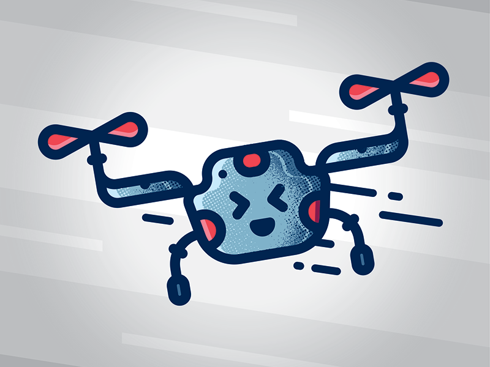

[![MIT License][license-shield]][license-url]
[![LinkedIn][linkedin-shield]][linkedin-url]

<!-- PROJECT LOGO -->
 

  

<h3 align="center">Follow me Dronie</h3>

  

    Dronie is an insecure drone who's scraed to be left alone, so it won't stop following you around. :)
     
    <a href="https://github.com/Aminekabene/Drone_Auto-Pilot">View Demo</a>
    ·
    <a href="https://github.com/Aminekabene/Drone_Auto-Pilot/issues">Report Bug</a>
    ·
    <a href="https://github.com/Aminekabene/Drone_Auto-Pilot/issues">Request Feature</a>
  

<!-- TABLE OF CONTENTS -->

  
Table of Contents

  <ol>
    <li>
      <a href="#about-the-project">About The Project</a>
      <ul>
        <li><a href="#The-Detector">The Detector</a></li>
        <li><a href="#The-Tracker">The Tracker</a></li>
        <li><a href="#built-with">Built With</a></li>
      </ul>
    </li>
    <li><a href="#roadmap">Roadmap</a></li>
    <li><a href="#contact">Contact</a></li>
  </ol>

<!-- ABOUT THE PROJECT -->
## About The Project

[![Product Name Screen Shot][product-screenshot]](https://example.com)

As you can see, Dronie can detect and track multiple objects in a frame. Once a target is selected, the drone will track the selected object relative to its position in the frame.

(<a href="#readme-top">back to top</a>)

## The Detector

Before any kind of tracking happens, you need to be able to detect the object you want to track.
However, doing this the "old" way with edge detection algorithms would be difficult and unreliable.
 
Luckely for us, Deep Neural Networks are a thing! **Ladies and gentleman let me introduce you to **_[YOLO](https://github.com/ultralytics/yolov5)_**** !
 
 
Yolo is a Deep Neural Network (DNN) firstly proposed by researchers: Joseph Redmon, Santosh Divvala, Ross Girshick and Ali Farhadi. This DNN can detect, localize and classify up to 80 different classes of objects in a single image.
 It works by segmenting the image in N grids of equal size. Each of these grids is responsible for the detection and localization of the object it contains.

## The Tracker

Every Object detected is assigned a class and instance id. To track a specific object you need to simply provide the class name and instance id of the object you want to track.
`Example: person 0`
 
 
Note that I am not using any advanced trakcing techniques here such **SORT** or **DeepSORT**. This tracker is a simple one that can only track objects of different classes on a frame by frame basis. 
 
 
This not meant to be use in a scenario where you would want to track a specific instance of an object in a frame containing multiple instances of that object.
For example: Tracking a person in crowded street. 

### Built With

* [![yolov5][yolov5]][yolov5-url]
* [![pytorch][pytorch]][pytorch-url]
* ![tello][tello]
* [![OpenCV][OpenCV]][OpenCV-url]
* [![Python][Python]][Python-url]

(<a href="#readme-top">back to top</a>)

<!-- ROADMAP -->
## Roadmap

- [ ] Web / Mobile App
- [ ] Sprint Mode

I am not sure which feature I want next if any at all. Let me know what you would like to see next [here](https://github.com/Aminekabene/Drone_Auto-Pilote/issues).

(<a href="#readme-top">back to top</a>)

<!-- CONTACT -->
## Contact

Amine Kabene

* Email:  **kabenea99@gmail.com**
* LinkedIn: [Amine Kabene](https://www.linkedin.com/in/amine-kabene/)
* Discord: dzskillz#2196

Project Link: [https://github.com/Aminekabene/Drone_Auto-Pilot](https://github.com/Aminekabene/Drone_Auto-Pilot)

(<a href="#readme-top">back to top</a>)

## Thank you for checking out my project! ;)

<!-- MARKDOWN LINKS & IMAGES -->
[license-shield]: https://img.shields.io/github/license/aminekabene/Drone_Auto-Pilot.svg?style=for-the-badge
[license-url]: https://github.com/Aminekabene/Drone_Auto-Pilot/blob/main/LICENSE
[linkedin-shield]: https://img.shields.io/badge/-LinkedIn-black.svg?style=for-the-badge&logo=linkedin&colorB=555
[linkedin-url]: https://www.linkedin.com/in/amine-kabene/

[pytorch]: https://img.shields.io/badge/pytorch-000000?style=for-the-badge&logo=pytorch&logoColor=red
[pytorch-url]: https://pytorch.org/
[OpenCV]: https://img.shields.io/badge/OpenCV-000000?style=for-the-badge&logo=opencv&logoColor=green
[OpenCV-url]: https://opencv.org/
[Python]: https://img.shields.io/badge/Python-000000?style=for-the-badge&logo=Python&logoColor=yellow
[Python-url]: https://www.python.org/

[yolov5]: https://img.shields.io/badge/YoloV5-000000?style=for-the-badge&logo=yolo&logoColor=
[yolov5-url]: https://github.com/ultralytics/yolov5
[tello]: https://img.shields.io/badge/Dji_Tello-000000?style=for-the-badge&logo=drone&logoColor=orange

